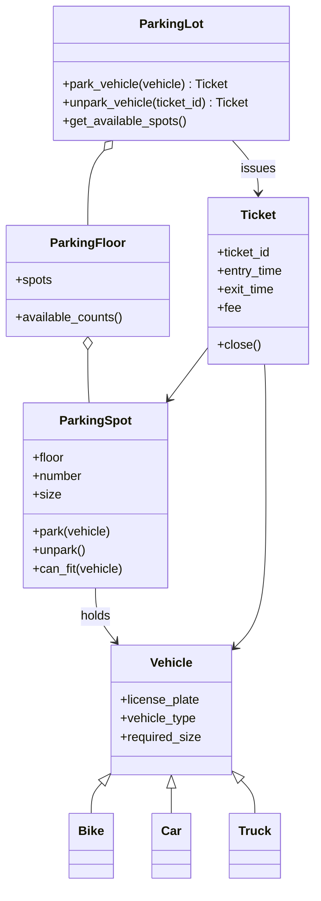

# Scalable Parking Lot

A multi-floor garage that assigns the nearest compatible stall, looks vehicles up in constant time, and computes the fee when the vehicle leaves.

`ParkingLot` is a composition of floors. Each floor is a list of `ParkingSpot`s. Vehicles are a small hierarchy — `Bike`, `Car`, `Truck` — and each one advertises the stall size it needs. A bike may take a larger stall. A truck may not take a smaller one.

On park, the lot picks the nearest compatible stall: lowest floor, then lowest spot number. It does not scan the garage. Free stalls sit in a min-heap per size. Plates and ticket ids sit in hash maps. Park and unpark are O(log n) for the heap and O(1) for the maps. Unpark closes the `Ticket`, which owns the fee, and pushes the stall back onto the heap.

## Run

```bash
python3 parking_main.py
```

The console is only input and output. The domain stays in the `parking` package.

```
  1. Park a vehicle
  2. Unpark by ticket
  3. Available spots
  4. Look up a plate
  5. Show active tickets
  6. Demo: park bike, car, truck then unpark
  0. Exit
```

The default garage is two floors. Each floor has 4 small, 4 medium, and 2 large stalls. Spot `F01-S001` is the stall closest to the entrance.

## Requirements

### Functional

- Multiple floors, each with a configurable mix of `SMALL`, `MEDIUM`, and `LARGE` spots.
- Vehicle types: bike, car, and truck, each with a different minimum size.
- `park_vehicle(vehicle)` returns a `Ticket` for the nearest compatible spot.
- `unpark_vehicle(ticket_id)` returns the closed ticket and its fee.
- `get_available_spots()` reports free counts by floor and size.
- A plate that is already parked is rejected. A lot with no compatible stall is rejected.

### Non-functional

- Park, unpark, and "is this plate inside?" stay fast as the garage grows.
- Adding a floor or a vehicle type does not rewrite `ParkingLot.park_vehicle`.
- Full, duplicate, and unknown-ticket cases raise domain exceptions.
- The fee rule lives on `Ticket`, so the lot is not the cashier.

### Assumptions

- Nearest means floor ascending, then spot number ascending. Spot 1 on a floor is closest to the entrance.
- A vehicle may use a larger stall when that stall is nearer than an exact-size stall farther away.
- One vehicle per plate. One open ticket per vehicle.
- Minimum one hour billed, then round up to the next hour. Bike $1, car $3, truck $6.
- Single-threaded. Locking is an extension, not the current implementation.
- No reservations, EV chargers, or handicap-only spots until those are added.

## Classes



`create_vehicle(type, plate)` is the factory. Callers name a type and a plate. They do not construct `Bike`, `Car`, or `Truck` themselves. `ParkingLot` is the facade: the application talks to that one object.

| Module | Responsibility |
|---|---|
| `parking/types.py` | `VehicleType`, `SpotSize`, which sizes fit, hourly rates |
| `parking/vehicle.py` | Vehicle hierarchy and `create_vehicle` |
| `parking/spot.py` | One stall: occupancy and `can_fit` |
| `parking/floor.py` | Builds numbered spots and counts free stalls |
| `parking/ticket.py` | Ticket ids, entry and exit times, fee |
| `parking/lot.py` | Indexes, nearest assignment, park and unpark |
| `parking_main.py` | Console only |

### Vehicle, Bike, Car, Truck

Identity is the license plate, normalized to uppercase. Subclasses do not override behavior. They declare `vehicle_type` and `required_size` on the class. The lot never writes `isinstance(v, Truck)`. It asks `v.required_size`. Adding a van is a new subclass plus one factory-map entry.

### Spot size

`SMALL = 1`, `MEDIUM = 2`, `LARGE = 3`. A stall fits a vehicle when `spot.size >= required`. `COMPATIBLE_SIZES` is the table the heap walker uses:

| Vehicle needs | Stalls it may use |
|---|---|
| small | small, medium, large |
| medium | medium, large |
| large | large |

### ParkingSpot

A spot knows its floor, number, size, and current vehicle. `park`, `unpark`, and `can_fit` live here, so a truck cannot land in a small stall even if a bug skipped the heap filter.

Spot ids look like `F01-S005`: floor 1, stall 5.

### ParkingFloor

A floor builds spots in entrance order: all small, then medium, then large, numbered from 1. It does not assign vehicles. Where stalls live is separate from which stall is chosen.

### Ticket

A ticket is created on park and closed on unpark. The fee is computed only in `close()`, so an open ticket does not hold a stale price if rates change during the stay. Ticket ids are a class counter: `T1`, `T2`, `T3`.

```text
hours = (exit - entry) in hours
billed_hours = max(1, ceil(hours))
fee = billed_hours * hourly rate
```

| Parked for | Hours billed | Car at $3 |
|---|---|---|
| 10 minutes | 1 | $3 |
| exactly 1 hour | 1 | $3 |
| 1 hour 1 minute | 2 | $6 |

### ParkingLot

The facade. It owns the floors, the hash maps, and the heaps. Outside code parks through `park_vehicle`. One park updates the spot, the ticket map, and the plate map together.

## Data structures

Five indexes, each with a job:

| Index | Job |
|---|---|
| `_spots`: spot id → spot | O(1) resolve a heap entry or a ticket's stall |
| `_active_tickets`: ticket id → ticket | O(1) unpark by ticket id |
| `_parked`: plate → ticket | O(1) duplicate-plate check and plate lookup |
| `_available`: size → min-heap of `(floor, number, spot id)` | nearest free stall of one size, O(log n) push and pop |
| `_available_ids`: size → set of spot ids | drop stale heap entries |

### Why a heap

A scan of every floor and every spot is O(S) per park, where S is the number of stalls. That is fine for 50 spots and poor for a stadium. A min-heap keyed by `(floor, number, id)` returns the nearest free stall of one size in O(1) peek and O(log n) pop.

### Nearest across compatible sizes

A bike can sit in three heaps. The lot peeks the live head of each compatible heap and takes the minimum `(floor, number)`. It then marks that id removed. It does not pop the other heaps.

Example: floor 1 has no free small stalls. Floor 1 medium #4 competes with floor 2 small #1. `(1, 4)` wins, so the bike takes a medium stall on floor 1. That is "nearest," which is different from "prefer an exact size even if it is farther."

### Lazy heap deletion

`heapq` cannot delete an arbitrary element in O(log n). On assign, the id is removed from `_available_ids` and the tuple stays in the heap. The next peek pops stale heads until it finds an id that is still free.

### Why a hash map for plates

Two tickets for one car is a real bug. Scanning active tickets is O(parked). A dict is O(1).

## Flows

### Park

1. If the plate is in `_parked`, raise `VehicleAlreadyParkedError` and include the existing spot.
2. Take the nearest compatible spot. If there is none, raise `NoSpotAvailableError`.
3. `spot.park(vehicle)` checks size and occupancy again.
4. Create a ticket, index it by ticket id and plate, and return it.

### Unpark

1. Pop the ticket from `_active_tickets`, or raise `UnknownTicketError`.
2. `spot.unpark()`, then `ticket.close()`, which writes the exit time and the fee.
3. Remove the plate from `_parked` and push the stall back onto the heap.
4. Return the closed ticket so the booth can print the fee.

The fee is printed from menu option **2. Unpark by ticket**. Option 6 unparks only the demo car `CR-202` and prints that one fee.

### Available spots

`get_available_spots` walks the floors and counts free stalls by size. That is O(S). It is a report, not the hot path. A dashboard that needs O(1) would keep running counters updated on push and pop.

## OOP

**Encapsulation.** Occupancy is `ParkingSpot._vehicle`. The availability indexes are private on the lot. The console uses `park_vehicle`, `unpark_vehicle`, and `get_available_spots`.

**Abstraction.** Callers know "nearest compatible spot." They do not know there is a heap, so the heap can later become a tree without touching `parking_main.py`.

**Inheritance.** `Vehicle` is the only hierarchy. Any `Vehicle` can be parked. Spot variants stay a size enum unless behavior actually diverges.

**Polymorphism.** `create_vehicle` returns a `Vehicle`. `park_vehicle` accepts a `Vehicle`. The fee uses `vehicle.vehicle_type` to index `HOURLY_RATE`. A new type plugs in without editing the park flow.

**Composition.** The lot has floors, floors have spots, and a ticket has a vehicle and a spot.

## SOLID

| Principle | In this design |
|---|---|
| Single responsibility | `Vehicle` is who is parking. `ParkingSpot` answers whether this stall can hold this vehicle now. `ParkingFloor` is the layout of one level. `Ticket` is duration and money. `ParkingLot` is assignment, indexes, and the use-case API. `parking_main.py` is human I/O. |
| Open/closed | `park_vehicle` does not change when a van or a third floor is added. A new vehicle is a subclass, a factory entry, and an optional new `SpotSize`. |
| Liskov substitution | Any `Vehicle` passed to `park_vehicle` is parkable from `required_size`. `Bike`, `Car`, and `Truck` only specialize those two class attributes. |
| Interface segregation | The public API is park, unpark, availability, and lookups. Floors do not park. Spots do not compute fees. |
| Dependency inversion | `ParkingLot` depends on `Vehicle`, not on `Car`. The factory returns a `Vehicle`. |

`HOURLY_RATE` lives in `types.py`. A `PricingPolicy` is the next split if rules grow: grace period, night rate, or an EV surcharge. `Ticket` would then depend on that policy instead of a dict.

## Patterns

| Pattern | Where |
|---|---|
| Simple factory | `create_vehicle(type, plate)` hides the `Bike`, `Car`, and `Truck` constructors |
| Facade | `ParkingLot` is the one object the application talks to |
| Composite-style tree | Lot → floor → spot. Available counts roll up the tree |
| Strategy, ready to extract | Nearest-spot assignment and pricing, if a second policy appears (for example "prefer exact size") |

Not used: a singleton lot (it blocks tests and a second garage), an observer for gate displays (they can call `get_available_spots`), and an object pool (spots are stalls, not disposable workers).

## Complexity

| Operation | Cost |
|---|---|
| `park_vehicle` | O(1) plate check, then O(k log n) to pick the nearest stall. k is the number of compatible sizes, at most 3, so about O(log n) |
| `unpark_vehicle` | O(1) map updates and O(log n) heap push |
| `find_vehicle` / `find_ticket` | O(1) |
| `get_available_spots` | O(S), S = total spots. Optional O(floors) with counters |
| Memory | O(S) spots, O(S) heap entries, O(P) tickets, P = parked vehicles |

## Concurrency and scale

This implementation is single-threaded. Two booths calling `park_vehicle` at once could pop the same heap head. Fixes, from simplest to production:

- One lock around park and unpark.
- One lock per size, so a bike heap and a truck heap can proceed together.
- A database transaction that locks the chosen spot row.
- A distributed lot: a Redis sorted set, or a lease that holds a spot for a few seconds while payment confirms.

At larger scale the in-memory maps become Redis hashes, and the heap becomes a sorted set whose score is `floor * K + number`. The class diagram stays the same.

## Extensions

- Handicap, EV, or compact stalls: a flag on `ParkingSpot`, filtered in nearest-spot selection.
- Reservations: hold a spot with an expiry, and return expired holds to the heap.
- Dynamic pricing: a policy of time, occupancy, and vehicle type.
- Several entrances: the heap key becomes distance to the entrance that was used, instead of `(floor, number)`.
- Payment: `Ticket` stays. A payment service charges on close. The lot does not talk to a payment provider.
- Display boards: poll `get_available_spots`, or notify them when counts change.

## Design choices

**A nearer large stall beats a farther small stall.** Nearest is physical `(floor, number)` among compatible stalls. If the product instead wants "never put a bike in a large stall while any small stall exists," that is a different strategy: walk sizes from smallest to largest, and ignore distance. The current code implements nearest.

**10,000 spots.** Heaps stay O(log n) and maps stay O(1). Availability reports should switch to counters. At that size, persist the spots and keep the free-id heaps hot.

**Same plate twice.** `_parked` is checked before a stall is taken. The plate is uppercased. A database would also put a unique constraint on the plate.

**Where money lives.** `Ticket.close()`. If receipts need tax, the next class is a pricing policy or a billing service, not more branches inside the lot.

**One sorted list of every free spot.** Every park would then filter by size while scanning from the front, worst case O(S). A heap per size reaches a compatible candidate in O(log n).
